# Практична №11 Дослідження кольорових гармоній та інструментів аналізу кольору в [Adobe Color](https://color.adobe.com/)

#### Виконав:
#### Студент групи ІПЗ-2.03
#### Мільков Олександр

## Завдання:

1. Ознайомитися з поняттям кольорової гармонії, типами гармоній та колірними моделями
2. Створити палітри за різними принципами гармонії за допомогою Adobe Color
3. Згенерувати палітри зображень (Extract Theme) та градієнт (Extract Gradient)
4. Перевірити контрастність кольорових пар відповідно до стандартів доступності (WCAG)
5. Написати звіт

## Хід роботи:

### Аналіз

1. Ознайомитись з типами кольорових гармоній: Analogous, Monochromatic, Triad, Complementary, Split Complementary, Square, Custom
2. Розібратися з відмінностями між колірними моделями RGB, HSB, LAB
3. Досліджено інтерфейс Adobe Color для створення гармоній та перевірки контрастності кольорів

### Теоретична частина

1. Кольорова гармонія — це поєднання кольорів, яке викликає візуальну рівновагу та естетичне задоволення. Гармонія кольорів необхідна в дизайні для створення зрозумілих, зручних та привабливих інтерфейсів.
2. Типи гармоній:
- Analogous — схожі кольори поруч на колі
- Monochromatic — один колір у різній насиченості
- Triad — три кольори, рівновіддалені на колі
- Complementary — протилежні кольори
- Split Complementary — два сусідніх до комплементарного
- Square — чотири рівновіддалені кольори
- Custom — побудова за власним вибором
3. Колірні моделі:
- RGB — для цифрових екранів
- HSB — відтінок, насиченість, яскравість
- LAB — математична модель для точного порівняння
4. Контрастність і WCAG — Стандарти WCAG 2.1 встановлюють рівні доступності (AA, AAA) для тексту щодо фону. Контраст забезпечує читабельність для всіх користувачів

### Результати

1. Робота з колірним колесом (Color Wheel):
   
   | Тип гармонії    |	Базовий колір |	Скріншот |	Логіка побудови і передбачуваний емоційний ефект |
   |-----------------|----------------|------------|---------------------------------------------------|
   | Analogous       | #5074DB        | 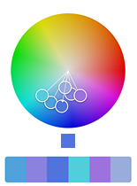 | Побудовано на сусідніх тонах — м’яка, гармонійна палітра; створює відчуття спокою й природності; базовий колір + підтримка + легкий акцент. |
   | Monochromatic   | #5074DB        | 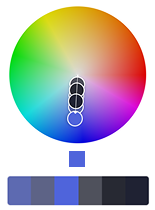 | Варіації одного кольору з різними рівнями яскравості та насиченості — виглядає стримано й стильно; підкреслює цілісність дизайну, викликає відчуття стабільності. |
   | Triad           | #5074DB        | 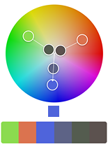 | Три рівновіддалені кольори на колі — жвава, збалансована схема; один домінує, два відіграють акцентні ролі; дарує динаміку та енергію. |
   | Complementary   | #5074DB        | 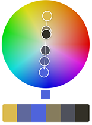 | Пара протилежних кольорів — сильний контраст, яскраво та енергійно; ідеально підходить для помітних акцентів і закликів до дії. |
   | Split Complementary  | #5074DB   | 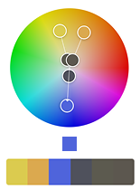 | Базовий колір + дві сусідні до його комплементарного — менш агресивна версія контрасту; контрастна, але м’якша для очей; безпечний варіант для акцентів. |
   | Square          | #5074DB        | 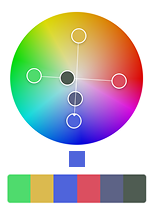 | Чотири кольори на однаковій відстані — яскрава, насичена палітра; потребує вибору одного домінуючого для підтримки візуальної рівноваги. |
   | Custom          | #5074DB        | 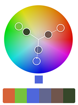 | Інтуїтивна гармонія на розсуд дизайнера — дозволяє створити унікальний настрій і відтінок бренду; акцент на творчості та експериментах. |
3. Створення палітри зображенням (Extract Theme):
   
   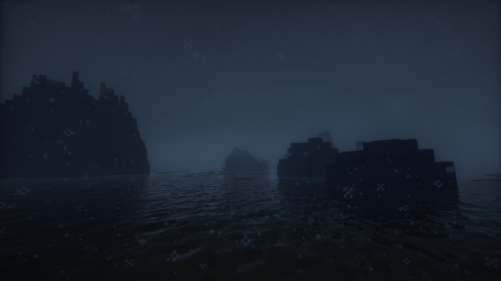
   | Тип |	Скріншот |	Коментар |
   |-----|-----------|-----------|
   | Colorful | 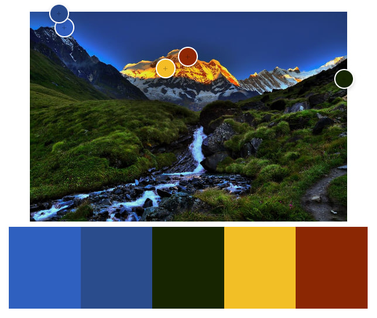 | Яскрава, насичена палітра з високою контрастністю — ідеальна для промо та акцентів, але може відволікати в інтерфейсі. |
   | Muted | 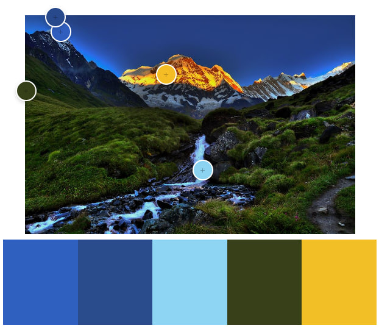 | Приглушені, збалансовані відтінки — створюють відчуття спокою й цілісності. Добре пасують для UI та фонових елементів. |
   
   Для інтерфейсу краще обрати **Muted** — більш спокійна й ненав’язлива палітра, що не відволікає користувача та забезпечує зручний досвід. **Colorful** доречна там, де потрібні яскраві акценти чи промо-матеріали.
5. Створення градієнту на основі зображення (Extract Gradient):
   
   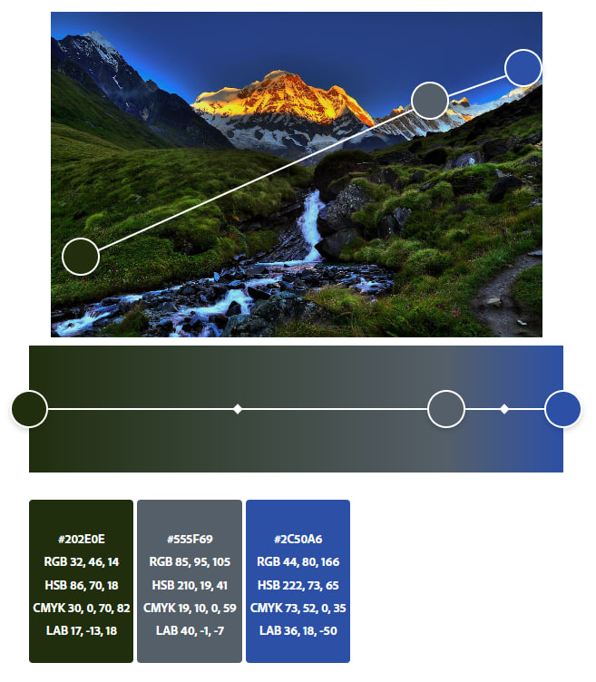
7. Аналіз контрасту (Accessibility Tools):
   
   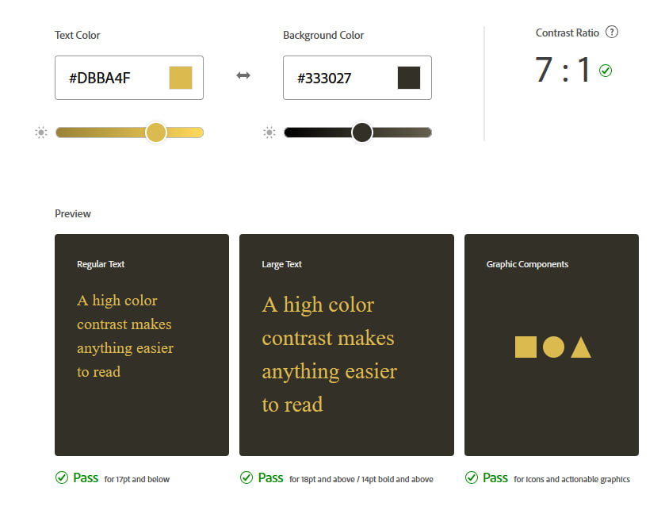
   #### Вибір кольорів відповідає стандарту коефіцієнта контрастності, тому можна лишати.

### Висновки

...

